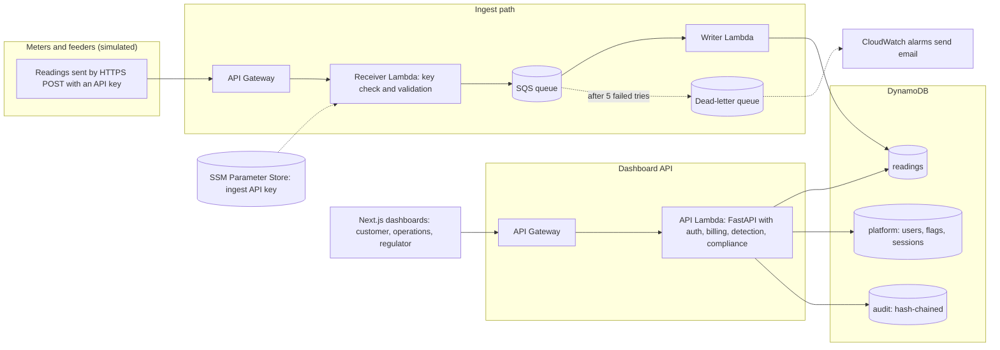

# Lume: NESI PowerTech Platform

Smart metering, billing, and **service accountability** for Nigeria's electricity sector, built for the NESI Innovation Challenge 2026 (PowerTech Track 1).

The differentiator: instead of only billing kWh consumed, verify the supply hours a feeder actually delivered against its NERC Band A-E commitment, and apply the 7-Day Rule from data.

- Full requirements: [docs/PRD.md](docs/PRD.md)
- Data is **simulated** at meter level. Feeder-level data should come from published DisCo/NERC sources where available. Always label simulated data as simulated.
- Front-end contributors: [docs/FRONTEND.md](docs/FRONTEND.md). Pitch preparation: [docs/PITCH_NOTES.md](docs/PITCH_NOTES.md).

## Architecture

Deployed on AWS (eu-west-1) with Terraform. Devices post readings to an ingest endpoint that queues them, so a slow or failing database never costs a reading. The dashboards read through a separate API.



## What is real and what is simulated

| Part | Status |
|---|---|
| AWS deployment: DynamoDB, SQS and dead-letter queue, three Lambdas, two API Gateways, SSM, alarms | **Real.** Deployed from `infra/terraform/` and checked by live smoke tests |
| Meter and feeder readings | **Simulated** |
| Theft cases | **Simulated**, injected by the simulator with ground truth |
| Detection accuracy | On the demo data, 9 of 9 injected cases caught and 0 false positives. The same team wrote the simulator and the detector, so this shows the logic works, **not** how it would perform on real meters |
| Band rules and the 7-Day Rule | Encoded from public NERC orders and press reports. Thresholds live in `config/bands.json`. Confirm them against the current order before relying on them |
| Official NERC feeder register (21 Kwara and Challenge feeders, including `UNILORIN 33KV FEEDER`, Band A) | **Real**, transcribed by hand from NERC's September 2026 IBEDC energy-cap publication. These feeders have no telemetry, so they are labelled `none` and hidden from the dashboards unless `?include_untracked=true` is passed. The energy cap is regulatory information, never delivered energy |
| Where each feeder's readings come from | Every feeder carries `simulated`, `authorized_external`, `lume_hardware`, `none` or `unknown`, and the API returns it. Unlabelled data is never treated as real |
| Tariffs and bills | **Placeholder rates** |
| Accounts | Demo accounts. The AWS seed generates random passwords and prints them once |
| Customer disputes, payments, live DisCo feeds | Not built |

## Known limitations

- The flag list reads a DynamoDB index that is eventually consistent, so a list can briefly show a stale status right after a decision. A single case view is always current.
- A full detection run takes about 12.5 s on 14 days of data and grows with the period. API Gateway cuts requests off at 30 s.
- The audit log is tamper-evident, not tamper-proof: the API role can overwrite an entry, and the hash chain would reveal it.
- Single region, no load test, no web application firewall, and no per-user login throttling (the API is rate-limited as a whole).
- The deployer account used during development has broad permissions.

## Layout

| Path | Purpose |
|---|---|
| `src/accountability/` | Engine: delivered hours, data coverage, Band classification, 7-Day Rule, compensation and exemption rules |
| `src/ingest/` | Reading validation, API Gateway-shaped handler, bulk loader, and the Lambda entry points (receiver and writer) |
| `src/billing/` | Itemised bills per meter per cycle, supply-backed estimation, downgrade credit recommendations |
| `src/detection/` | Theft and tamper flags with reason, confidence and evidence |
| `src/store.py`, `src/store_dynamodb.py` | The platform store: readings, flags, users, sessions, hash-chained audit log. SQLite for local runs, DynamoDB on AWS, both held to the same contract tests |
| `src/api/` | FastAPI backend: auth, role-scoped endpoints, CSV export, local device ingestion, and the Lambda entry point |
| `src/demo/seed.py` | Builds a fresh demo database with one account per role |
| `web/` | Next.js dashboards for customers, DisCo operations and regulators |
| `config/` | Band rules, tariffs (**placeholder rates**), detection thresholds |
| `simulator/` | Simulated feeders, meters, readings and injected theft (with ground truth) |
| `infra/terraform/` | AWS infrastructure: DynamoDB, SQS, Lambda, API Gateway, alarms, budget alert |
| `scripts/` | Lambda package builders, DynamoDB seeding, and live smoke tests |
| `docs/` | Requirements, front-end handoff, pitch notes |
| `tests/` | 260+ tests: engines, ingestion, billing, detection, API, both stores, Lambda handlers and packaging |

## Run the demo

Three terminals from the repo root.

```bash
# 1. Python setup and demo data (rebuilds data/platform.db)
python -m venv .venv && source .venv/bin/activate   # Windows: .venv\Scripts\activate
pip install -r requirements.txt
python -m src.demo.seed                              # prints the demo accounts

# 2. API on http://127.0.0.1:8000 (docs at /docs)
uvicorn src.api.main:app --reload

# 3. Dashboards on http://localhost:3000
cd web && npm install && npm run dev
```

Sign in as `customer`, `ops` or `regulator`. The password is `demo-password` unless you set `DEMO_PASSWORD` before seeding. That is for local use only: the AWS seed generates random passwords. The web app reads `API_URL` (default `http://127.0.0.1:8000`).

To accept readings from devices, set `INGEST_API_KEY` before starting the API and `POST /ingest` with an `X-Api-Key` header.

## Deploy to AWS

Needs AWS credentials, Terraform, and Python 3.12. The ingest API key lives in SSM, not in the repo or in Terraform state.

```bash
# once: create the ingest API key
aws ssm put-parameter --name /nesi-powertech/ingest-api-key --type SecureString --value "<a long random key>" --region eu-west-1

python scripts/build_lambda.py          # ingest package   -> build/lambda.zip
python scripts/build_api_lambda.py      # dashboard API    -> build/api.zip
cd infra/terraform
terraform init
terraform plan -var="alert_email=you@example.com" -out=tfplan
terraform apply tfplan

python scripts/seed_dynamodb.py --days 14                                  # simulated data, random passwords printed once
python scripts/smoke_dynamodb.py                                           # refuses tables that hold data
python scripts/smoke_ingest.py --url "$(terraform output -raw ingest_url)" # live end-to-end check, cleans up after itself
```

## Command-line tools

```bash
python -m src.ingest.load data/                      # safe to re-run: replays are deduplicated
python -m src.accountability.cli data/feeder_readings.csv --feeder F001 --band A
python -m src.billing.cli M0001 --from 2026-09-01 --to 2026-10-01   # add --json for machine output
python -m src.detection.run --truth data/injected_anomalies.csv     # scores flags against injected theft
pytest
```

## Rules worth knowing

- **Missing data is not an outage.** A day with less than `min_day_coverage` of its samples is reported as insufficient data, is not judged, and breaks any failure streak.
- **Estimation needs proof of supply.** A missing meter reading is estimated only if feeder data shows supply in that slot. If supply is unknown, the slot is not billed.
- **Recommendations are never applied.** Downgrade credits and compensation flags appear on the bill for a human to act on.
- **Flags are leads, not findings.** All flags on one meter or feeder form a single case, ranked by its strongest signal. Confirming or dismissing a case needs a note, covers every flag in it, and lands in the audit log. A new flag reopens a decided case.
- **The audit log is append-only.** Each entry hashes the previous one; `GET /audit` reports whether the chain is intact.

## Roadmap

1. [x] Accountability engine and simulator
2. [x] Ingestion: validation, dedup, store, API handler
3. [x] Billing engine (rates are placeholders)
4. [x] Dashboards: customer, operations, regulator, audit trail
5. [x] Theft detection (rules-based)
6. [x] Auth, roles, audit log
7. [x] AWS: DynamoDB store, ingest path (API Gateway, SQS, Lambda), dashboard API on Lambda, Terraform, alarms
8. [ ] Host the dashboards (Vercel planned)
9. [ ] Narrow the deployer's permissions
10. [ ] Detection runtime headroom: cap the period or run it asynchronously
11. [ ] Customer disputes (P2)
